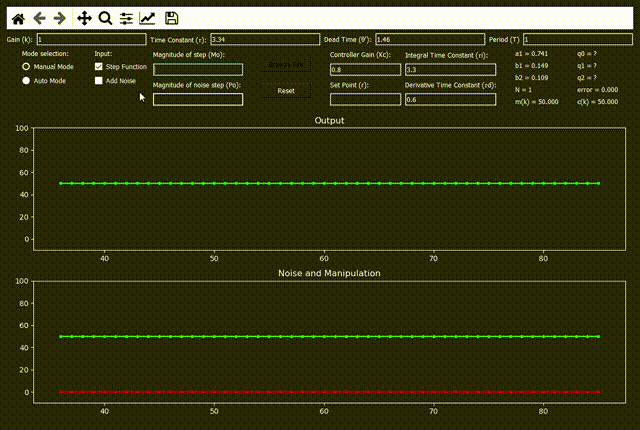

# Dynamic Process Simulator

This Computerized Control Project is an implementation of a First Order Dynamic Process Simulator
with the option to add a noise step function to the system.

## Getting Started

User needs to provide the the following inputs for the system to start plotting data:
- Static gain (k)
- Time Constant (𝜏)
- Dead Time (θ')
- Period (T)

If using an input step function, must provide magnitude:
- Magnitude of step (Mo)

If using a file, select a .txt file with a single column providing the input data as shown in [sample_input.txt](sample_input.txt).

### Prerequisites

This project was implemented using Python 3.7.4.   
The following python dependencies are required:
- PyQt5 (version 5.14.1)
- matplotlib (version 3.2.1)

## Authors

* **Raul Ceron** - *Initial work* - [receronp](https://github.com/receronp)

## License

This project is licensed under the MIT License - see the [LICENSE.md](LICENSE.md) file for details

## Acknowledgments
* Project proposal provided by Dr. Antonio Favela - [Control Engineering Research Site](https://research.tec.mx/vivo-tec/display/PID_406)
* Dynamic plotting example of implementation at [Embedding In QT5](https://matplotlib.org/gallery/user_interfaces/embedding_in_qt5_sgskip.html)
